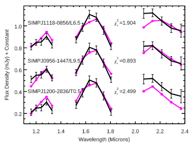

# _Python for Scientific Data Analysis_

## Homework #5 (due Oct 16, 6 pts total)


### 1. Root-Finding/Minimization (LM algorithm)

Consider the function $f(x) = x^{2}+-5*x+1.5*cos(x^{2}) + sin(x)$

* Find the roots of this function using the Levenberg-Marquardt algorithm
* Verify your answer by calculating $f(x)$ at the value of these roots


### 2. Root-Finding/Minimization (Newton-Raphson)

Consider the function $2x^{3}+3x^{2}-4x-5$

* Compute the value of this function at integers 1, 2,3, 4,and 5.
* Based on the above give a starting guess for the integer closest to the root of this function
* Use the definition of the Newton-Raphson method, to estimate the first update of the root of this function from:

      $x_{1}$ = $x_{o}$ - $f(x_{o})$/$f^{\prime}(x_{o})$
      
      (Note: it is easiest to define two functions -- func(x) and funcd(x) -- corresponding to the function and its derivative at some value x and call these functions in your manual N-R first estimate
      
      
* Compute the real root estimate from the Newton-Raphson method using again your starting integer value.  
* Verify that your solution is indeed a root of this function

* How close were you to the solution from just the first iteration?


### 3. Applications of PCA (yes, _one_ more PCA assignment)

This one is a bit more involved.  In our course notes, we showed an application of using PCA  used in a machine learning algorithm trained on a set of digits to then classify noisy digits.  I gave one canned example of a nPCA = 50 transform of the digits set leading to a 70% classification accuracy. 

Now ...

*  write a Python function to perform the same classification on the same noisy digits -- i.e. using

```
np.random.seed(42)
noisy = np.random.normal(digits.data, 5)
```
to make the digits noisy ...

where the number of PCs is a free parameter that you set when calling the function

* do an iteration -- from 1 PC to 64 PCs -- returning the value of the classification accuracy

* plot up the results, e.g.

```
plt.plot(npca,accuracy)
plt.show()

```
* repeat the above but add the 'noisiness' as a free parameter for the function, e.g. 
where in part #1 it is 5 but in this part you set it to 15 here.

-which range of PCs give the most accurate model prediction in both cases?
-Which trends to do you see?

### 4. Basic Statistics with SciPy and NumPy

The file ``diskmasses.txt`` now found in the problem set directory for this section contains estimates for the masses (er, log(disk mass)) of protoplanetary disks for a large number of stars in the Taurus-Aurigae star-forming region.   

* Read in this file using ``np.loadtxt``.  
* Compute the mean, median, and _sample_ variance of the log(disk mass) with NumPy .   
* Compute the 25th and 75th percentile for log(disk mass).

### 5. Goodness-of-Fit, $\chi_{\nu}^{2}$

See the attached figure panel comparing the spectrum of a brown dwarf to a library of other substellar objects.   Assume that each model fit loses one degree of freedom (so $\nu$ = 1). 

- Compute the $\chi^{2}$ values for the three model fits.
- Compute the $p$ values for the three model fits.  




### 6. Course Project (0.5 pts)

By now, hopefully you have either refreshed your memory of basic Python code, NumPy operations, and numerical linear algebra or have learned a lot.  We will be covering some very basic fitting routines with SciPy next before moving on to plotting and displaying data with Matplotlib.

So now would be a good time to think about what you _might_ be interested in learning more about for your Class Project that is not covered explicitly in the syllabus/course schedule.

* What type of Project do you currently think you would like to focus on? 

I will try to give you some feedback and hopefully we can define a project that you will find interesting and helpful.


### 7. Feedback (0.5 pts)

We are now about 5 weeks into the course (about 1/3 of the way done!).  Structurally, what in your opinion is working with the course? What is not working?
